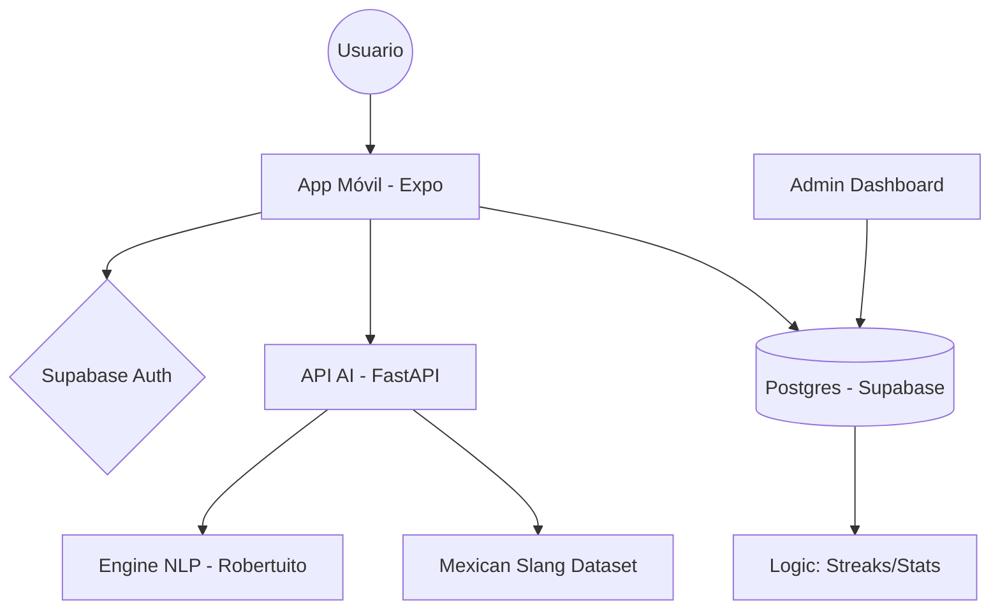

# MindMood: Diario Inteligente - Documentación Técnica v2.0

> **Arquitecto Senior**: AI Assistant (Antigravity)
> **Materia**: Ingeniería de Software / Arquitectura de Sistemas
> **Estado**: Producción (Versión Estable)

---

## 1. Visión General del Proyecto

**MindMood** es un ecosistema de salud mental multiplataforma diseñado para el seguimiento emocional cuantitativo y cualitativo. Utiliza Inteligencia Artificial avanzada para analizar el lenguaje natural del usuario, detectar crisis en tiempo real y visualizar la trayectoria del bienestar mediante métricas granulares.

### Arquitectura de Alto Nivel

El sistema sigue un patrón de **Microservicios Híbridos**:

1. **Client Tier**: Aplicación móvil nativa (Expo/React Native).
2. **AI Engine Tier**: Microservicio RESTful (FastAPI/Python) para NLP.
3. **BaaS Tier**: Infraestructura persistente y de seguridad (Supabase/Postgres).

---

## 2. Componentes del Sistema

### A. Cliente Móvil (React Native + Expo)

- **Propósito**: Interfaz de interacción con el usuario para el registro de pensamientos y visualización de progreso.
- **Tecnologías Clave**:
  - **React Native / Expo**: Core del desarrollo multiplataforma.
  - **Context API (ThemeContext)**: Gestión de diseño dinámico (Modo Oscuro/Claro) y persistencia de preferencias estéticas.
  - **Gifted Charts**: Motor de renderizado para `LineChart` y `PieChart` con soporte de animación fluida.
- **Funcionamiento Interno**:
  - **Manejo de Estados**: Utiliza `useState` y `useEffect` para el ciclo de vida de los datos, con integración directa de `AsyncStorage` para borradores (drafts).
  - **Comunicación**: Consume el microservicio AI mediante `fetch` con lógica de *retry* y detección automática de latencia para alternar entre nodos (Local vs Cloud).
- **Actualización Automática**: Cualquier nuevo `Screen` añadido en la carpeta `/screens` debe ser registrado en la sección de "Rutas y Navegación" de este documento.

### B. Motor de Análisis AI (FastAPI + NLP)

- **Propósito**: Procesamiento de lenguaje natural, clasificación de emociones y detección de indicadores de riesgo.
- **Funcionamiento Interno**:
  - **Pipeline Híbrido**:
    1. **Pre-procesamiento**: Normalización de jerga mexicana (Dataset JSON) y corrección ortográfica (`pyspellchecker`).
    2. **Core NLP**: Modelo `Robertuito` (pysentimiento) para clasificación de 7 emociones básicas.
    3. **Refuerzo Heurístico**: Análisis de intensidad mediante VADER (compound score) y detección de gritos (Caps detection).
    4. **Normalización de Acentos**: Proceso CDI que elimina tildes para asegurar que palabras como "asco" y "asquerósa" se detecten por igual.
  - **Lógica de Crisis**: Capa prioritaria que intercepta mensajes de desesperanza extrema mediante Regex y Keywords, forzando un puntaje de `-0.95`.
- **Backend Integration**: Expuesto vía **FastAPI** con Pydantic para validación de esquemas y Uvicorn como servidor ASGI de alto rendimiento.

### C. Base de Datos y Backend (Supabase / PostgreSQL)

- **Propósito**: Persistencia segura de perfiles, entradas históricas y lógica de negocio a nivel de DB.
- **Estructura Interna**:
  - **Tabla `profiles`**: Almacena metadatos del usuario (rol, idioma, racha/streak).
  - **Tabla `entries`**: Registro histórico de textos, scores de sentimiento y la distribución JSONB de emociones.
  - **Políticas RLS (Row Level Security)**: Garantiza que cada usuario solo acceda a sus propios datos mediante `auth.uid() = user_id`.
- **Lógica de Negocio (Server-side)**:
  - **Triggers**: Función `update_user_streak()` que incrementa automáticamente la racha del usuario tras cada inserción.
  - **RPC Functions**: Procedimientos almacenados para el Dashboard Administrativo (conteo de usuarios y actividad global).

---

## 3. Flujo de Trabajo (Workflow) Técnico

### Ciclo de Vida de una Entrada (Journaling Flow)

1. **Captura**: El usuario escribe en `NewEntryScreen`.
2. **Análisis**: El cliente envía el texto al `POST /analyze`.
   - El API detecta sentimientos y normaliza la distribución para que sume 100%.
   - Si se detecta "Crisis", se activa el flag `requires_help`.
3. **Respuesta**: El API devuelve un `AnalysisResponse` con el resumen empático generado dinámicamente.
4. **Persistencia**: El App guarda el resultado en Supabase.
5. **Feedback**: Se muestra un `EmotionModal` con diseño temático (sólido) basado en la emoción predominante.

### Proceso de Visualización (Stats Flow)

1. El `StatsScreen` consulta la tabla `entries` filtrando automáticamente por los **últimos 7 días** (Vista Semanal).
2. **Normalización**: Los datos se ordenan cronológicamente para representar la trayectoria emocional de la semana actual.
3. **Renderizado**: `LineChart` dibuja la trayectoria con un diseño minimalista y optimizado para evitar latencia o advertencias de rendimiento.

---

## 4. Stack Tecnológico Detallado

| Componente | Tecnología | Versión / Detalle |
| :--- | :--- | :--- |
| **Frontend Framework** | React Native (Expo SDK) | 51.0.x |
| **Estilos** | StyleSheet (Native) | Estética Glassmorphism |
| **Backend API** | FastAPI | Python 3.12+ |
| **NLP Model** | Robertuito-Emotion | Transformers (HuggingFace) |
| **Database** | PostgreSQL v15 | Alojado en Supabase |
| **Auth** | GoTrue (Supabase) | JWT / Email & Password |
| **Pruebas UI** | Maestro CLI | Automatización de flujos críticos |

---

## 5. Proceso de Actualización Automática (CDI)

Para garantizar que esta documentación no se vuelva obsoleta, se establece el siguiente protocolo:

1. **Documentación como Código (DaC)**: Este archivo reside en la sección de artefactos del asistente y en la raíz del proyecto.
2. **Mecanismo de Sincronización**:
   - **AI Assistance**: Al ser yo tu copiloto de codificación, tengo la instrucción de **actualizar este documento inmediatamente** después de realizar cambios estructurales o añadir funcionalidades clave (ej. Sistema de Zoom).
   - **Docstrings**: El backend debe mantener docstrings actualizados para generar las descripciones de este manual.

---

## 6. Diagrama Conceptual de Arquitectura

---

*Este documento es propiedad técnica de MindMood. Su última actualización fue el 11 de mayo de 2026.*
